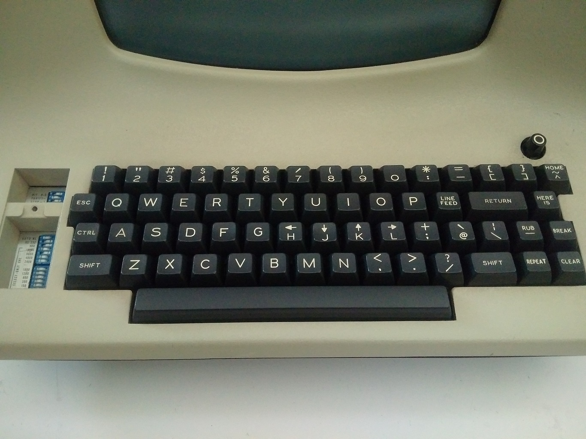

# remap.key.to.esc.ctrl
** Updated for AutoHotkey 2.0.4 **

Remap a key to be both escape and control depending on context. AutoHotKey v2 [version 2](https://www.autohotkey.com/v2/) 

A simple ahk2 script to rebind the capslock key to be escape on a short press and work as the control modifier key on a long press. The idea behind this is that the capslock key is in a prime position for such an unimportant key. Emacs and Vim were both developed on keyboards that had the control modifier where the capslock key is now located.

### Scripts
- `remap_caps_to_esc_ctrl.ahk` remap capslock
- `remap_ctrl_to_esc_ctrl.ahk` remap control
